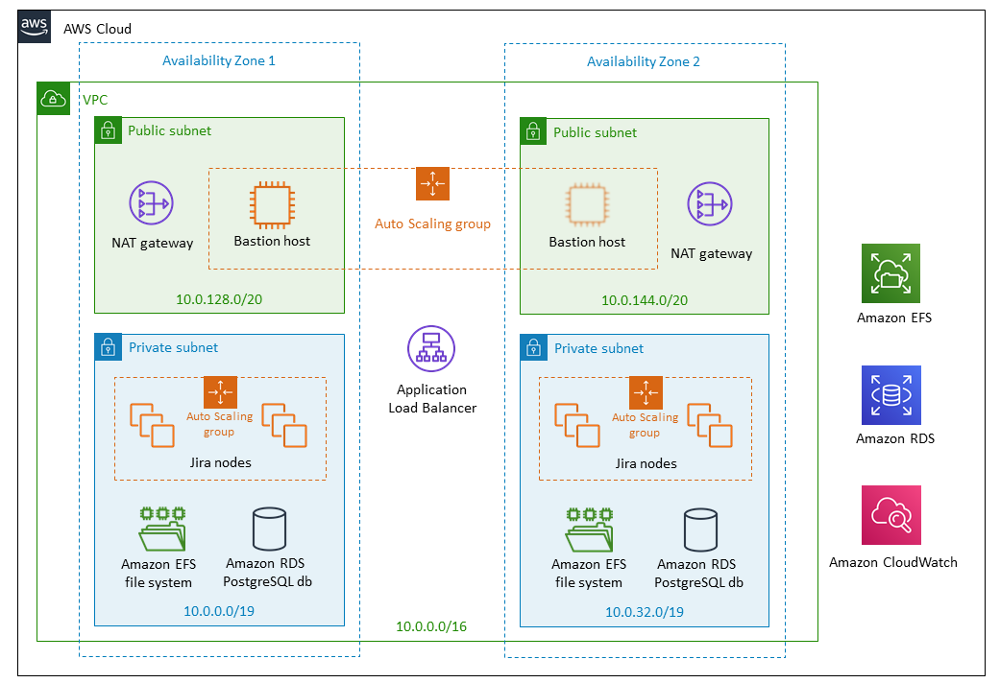

# AWS Q & A
- ### what’s EC2 Instance types?
  
  There are numerous EC2 Instance types available, each designed to cater to specific workload requirements.

    
  
    Here are some commonly used EC2 Instance types: 
    - `General Purpose Instances` (e.g., t2.micro, t3.medium) : These instances provide a balance of compute, memory, and network resources. They are suitable for a wide range of applications, including small to medium-sized databases, web servers, and development environments.
    - `Compute-Optimized Instances`  (e.g., c5.large, c5.4xlarge): These instances are designed for high-performance computing tasks that require significant compute power. They are ideal for applications such as scientific modeling, batch processing, and machine learning inference.
    - `Memory-Optimized Instances`  (e.g., r5.large, r5.24xlarge): These instances are optimized for memory-intensive workloads that require large amounts of RAM. They are well-suited for applications like in-memory databases, real-time analytics, and high-performance computing.
    - `Storage-Optimized Instances`  (e.g., i3.large, i3en.12xlarge): These instances are built to deliver high storage capacity and throughput. They are suitable for workloads that require low-latency access to large datasets, such as big data processing, data warehousing, and log analysis.
    
    And there are much more ...

    
    

- ### What’s AWS VPC?
  
  AWS VPC (Amazon Virtual Private Cloud) is a virtual network service provided by Amazon Web Services. It allows users to create their own isolated network environments within the AWS cloud. With VPC, users can define their network topology, control access, and securely connect their resources. It provides flexibility and control over network infrastructure in the AWS cloud.

  ---

  It is stands for Amazon Virtual Private Cloud. It is a virtual network service provided by Amazon Web Services (AWS) that allows users to create their own isolated virtual network environments within the AWS cloud.

  AWS VPC enables users to define their own network topology, including the selection of IP address ranges, creation of subnets, configuration of route tables, and establishment of network gateways. With VPC, users have complete control over their virtual network, allowing them to customize and secure their network infrastructure according to their specific requirements.

  Key features and benefits of AWS VPC include:
    - `Isolation and Security`: VPC provides a logically isolated network environment, allowing users to run their resources in a private, secure manner. Users can define security groups and network access control lists (ACLs) to control inbound and outbound traffic to their resources.
    - `Subnets`: VPC allows users to divide their virtual network into subnets, which are segments of IP address ranges. Subnets can be placed in different availability zones, providing high availability and fault tolerance for applications running in the VPC.
    - `Internet Connectivity`: AWS VPC can be configured to provide internet connectivity to resources within the virtual network. Users can attach an internet gateway to their VPC, allowing resources to communicate with the internet.
    - `VPN and Direct Connect`: VPC offers options for secure connectivity to on-premises networks. Users can establish a VPN (Virtual Private Network) connection or use AWS Direct Connect to establish a dedicated network connection between their VPC and their data center or office.
    - `Routing and Network Gateways`: VPC allows users to define and manage routing tables, which control the traffic flow between subnets and the internet. Users can also configure network gateways, such as NAT gateways or virtual private gateways, to enable specific connectivity requirements.
    - `Integration with AWS Services`: AWS VPC seamlessly integrates with other AWS services, such as Amazon EC2 (Elastic Compute Cloud), Amazon RDS (Relational Database Service), and Amazon S3 (Simple Storage Service). This integration allows resources within the VPC to securely communicate with and utilize these services.

    By leveraging AWS VPC, users can create a secure and isolated network environment for their applications and services in the AWS cloud. It provides flexibility, scalability, and control over the network infrastructure, enabling users to design and deploy their resources according to their specific networking needs.

    