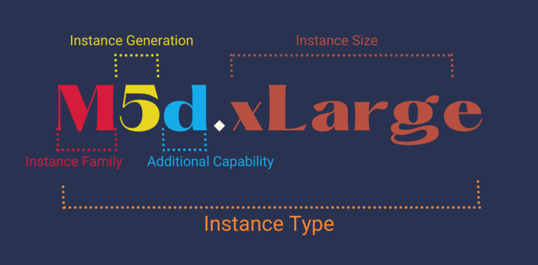

# AWS Q & A
- what’s EC2 Instance types?
  - There are numerous EC2 Instance types available, each designed to cater to specific workload requirements.

    
  
    Here are some commonly used EC2 Instance types: 
    1. `General Purpose Instances` (e.g., t2.micro, t3.medium) : These instances provide a balance of compute, memory, and network resources. They are suitable for a wide range of applications, including small to medium-sized databases, web servers, and development environments.
    2. `Compute-Optimized Instances`  (e.g., c5.large, c5.4xlarge): These instances are designed for high-performance computing tasks that require significant compute power. They are ideal for applications such as scientific modeling, batch processing, and machine learning inference.
    3. `Memory-Optimized Instances`  (e.g., r5.large, r5.24xlarge): These instances are optimized for memory-intensive workloads that require large amounts of RAM. They are well-suited for applications like in-memory databases, real-time analytics, and high-performance computing.
    4. `Storage-Optimized Instances`  (e.g., i3.large, i3en.12xlarge): These instances are built to deliver high storage capacity and throughput. They are suitable for workloads that require low-latency access to large datasets, such as big data processing, data warehousing, and log analysis.
    
    And there are much more ...
    
    
    